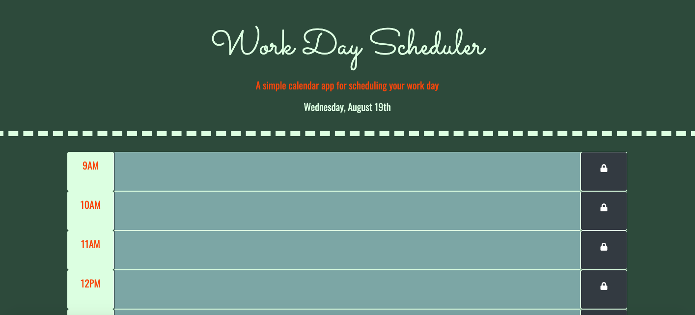

# ⏰ Workday Scheduler

This webpage is a work day scheduler that allows you to input events from 9AM-6PM each day.
 
⏰ [GitHub Repo]("https://github.com/LiliCecilia23/work-day-scheduler")
⏰ [Deployed App]("https://lilicecilia23.github.io/work-day-scheduler/")
 

## Usage Instructions
Upon navigating to the page, each hour block is color coded to indicate past, present, and future according to when the user is accessing the app. Users are only able to edit hour blocks for their current hour or later. The user can save the contents of each input field with the save/lock button on the right side of its hour block, which saves them to local storage so they will still be there even if the user refreshes the page.

## Technologies Used 
* HTML5 
* CSS3 
* JavaScript 
* JQuery 
* Bootstrap
* Moment.js
* Local Storage

## Contact
* [LinkedIn]("linkedin.com/in/lili-clift/")
* [GitHub]("github.com/LiliCecilia23")

